# cadquery-contrib
A place to share CadQuery scripts, modules, tutorials and projects

## Contents

### Examples

* [Braille.py](examples/Braille.py) - Configurable braille label/sign generator where user inputs text and the braille dots are generated automatically

    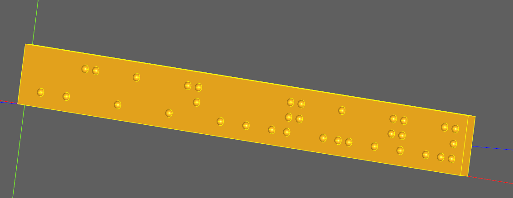

* [Panel_with_Various_Holes_for_Connector_Installation.py](examples/Panel_with_Various_Holes_for_Connector_Installation.py) - Example of creating various knock-out holes in a panel

    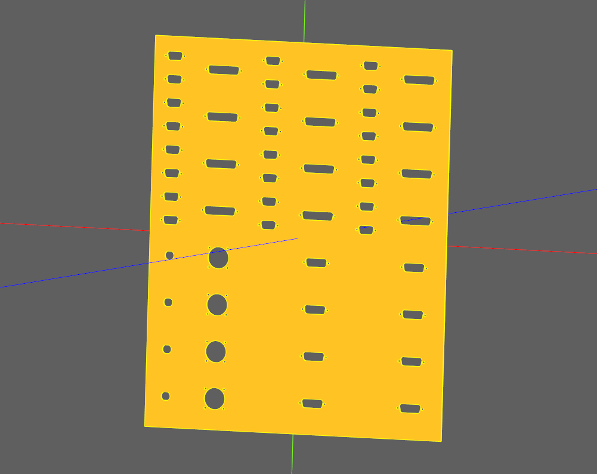

* [Parametric_Enclosure.py](examples/Parametric_Enclosure.py) - Standard CadQuery example of an electronics enclosure with a base, fastener bosses, and a lid

    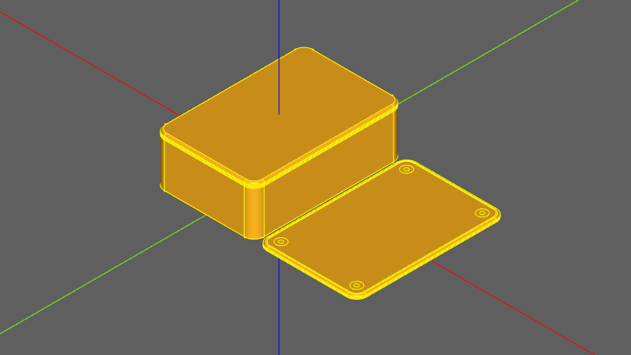

* [Reinforce_Junction_UsingFillet.py](examples/Reinforce_Junction_UsingFillet.py) - Example of using fillets to reinforce a joint, reducing stress concentrators at the joint

    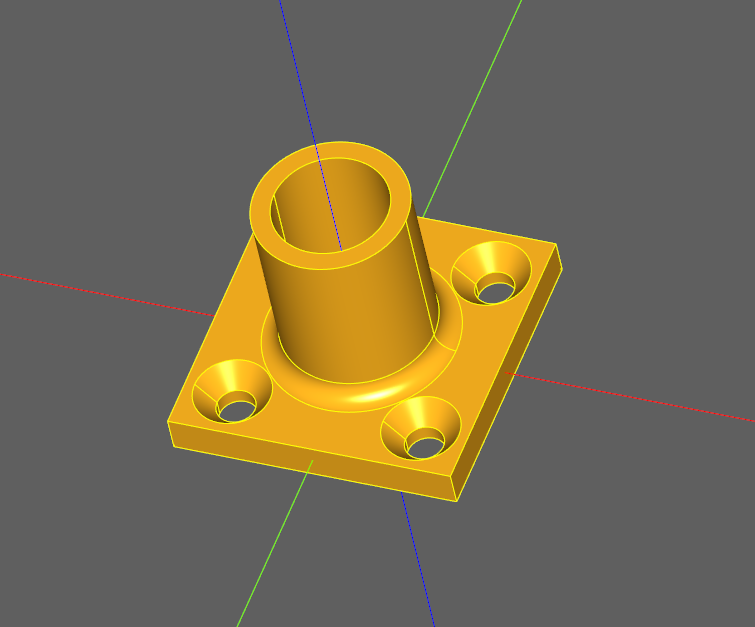

* [Resin_Mold.py](examples/Resin_Mold.py) - A resin casting mold created to repair the strain-relief on an expensive cable

    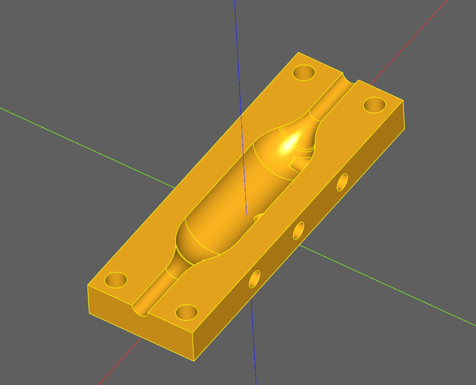

* [Shelled_Cube_Inside_Chamfer_With_Logical_Selector_Operators.py](examples/Shelled_Cube_Inside_Chamfer_With_Logical_Selector_Operators.py) - Shows a somewhat more advanced use of selectors to chamfer the inside edges of a shelled cube

    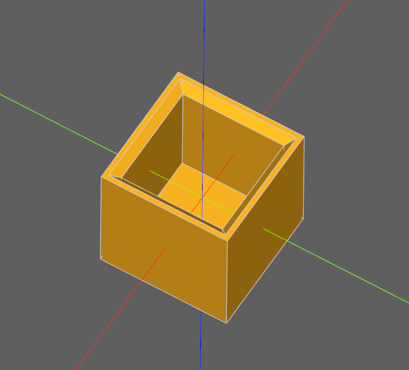

* [tray.py](examples/tray.py) - Manual assembly example including export to DXF for laser cutting

    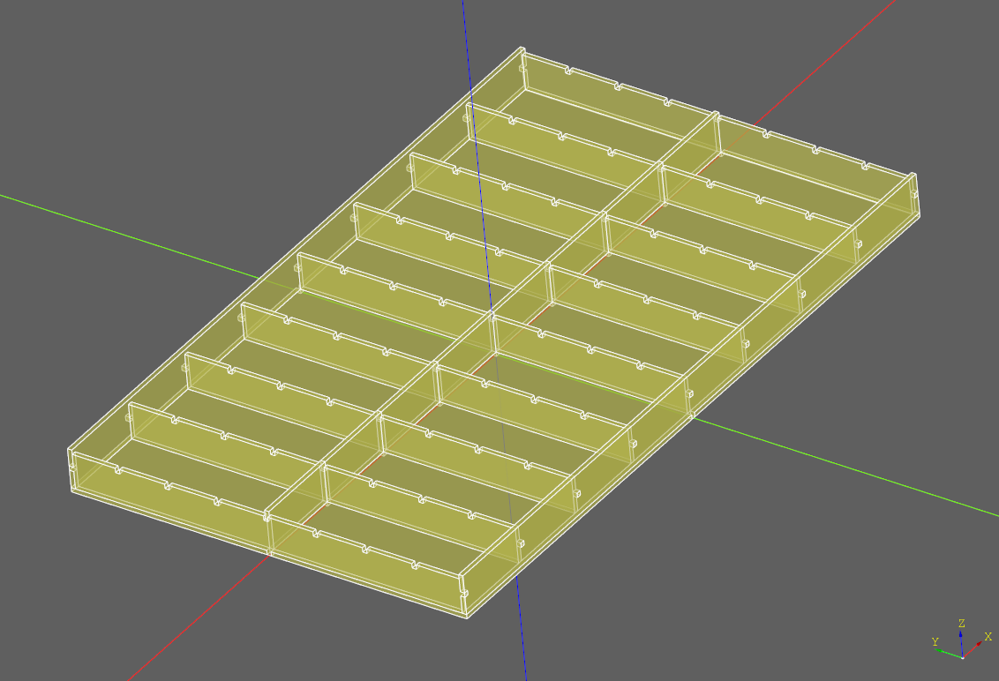

* [Tetrakaidecahedron.py](examples/Tetrakaidecahedron.py) - The Tetrakaidecahedron volume (Kelvin Cell) can pave 3D space and is often encountered in cristallography.

    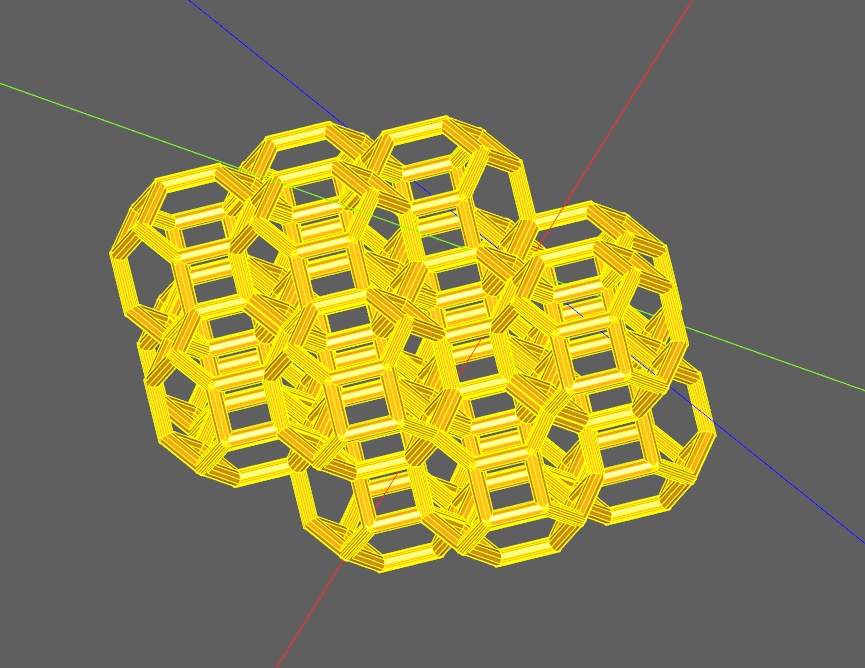

* [cylindrical_gear.py](examples/cylindrical_gear.py) - A cylindrical straight or helix gear

    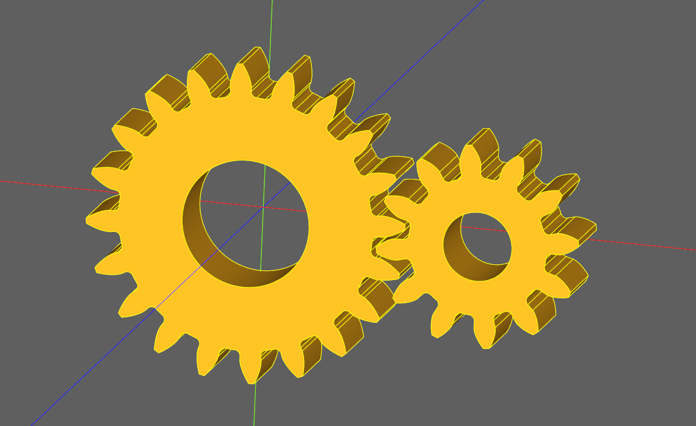

* [Remote_Enclosure.py](examples/Remote_Enclosure.py) - An electronics enclosure created to be mounted on motorcycle handlebars

    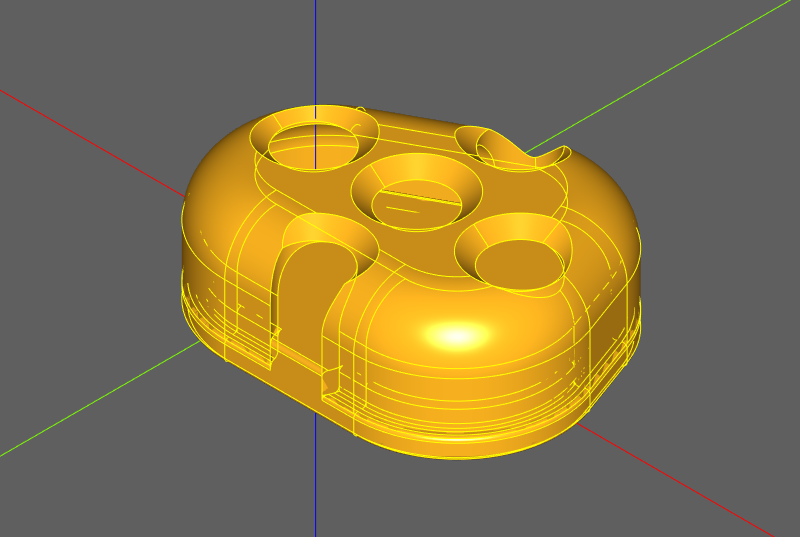

* [Classic_OCC_Bottle.py](examples/Classic_OCC_Bottle.py) - Standard OCCT bottle example, implemented using the CadQuery API

    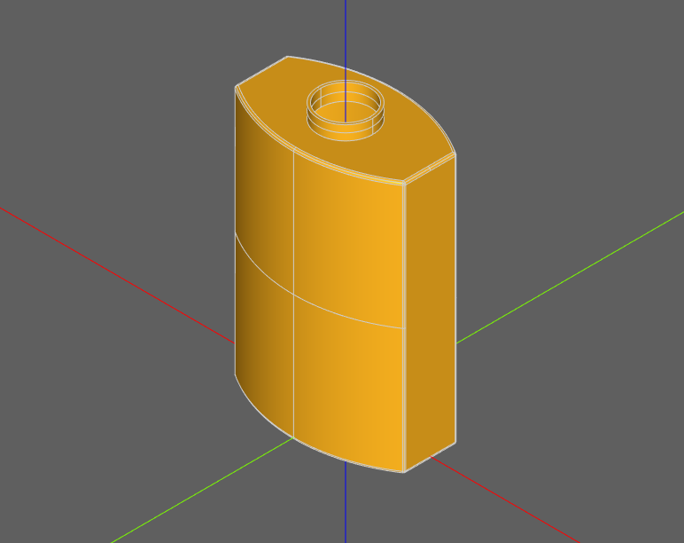

* [Numpy.py](examples/Numpy.py) - Example of integrating Numpy with CadQuery

    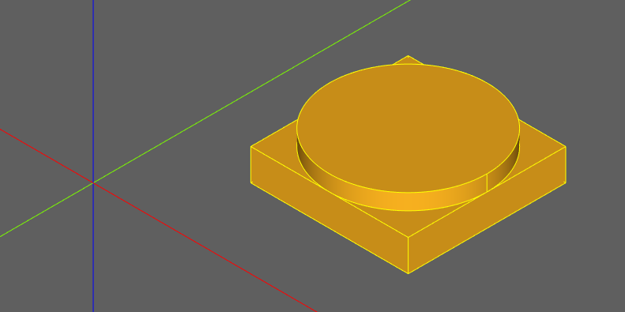

* [3D_Printer_Extruder_Support.py](examples/3D_Printer_Extruder_Support.py) - Designed for mounting hotend to an i3 X-carriage inspired by the P3steel Toolson

* [Involute_Gear.py](examples/Involute_Gear.py) - Fast involute gear generator.

    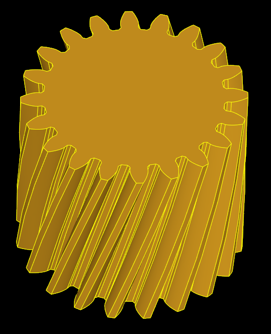   
  
* [Thread.py](examples/Thread.py) - Thread example.

    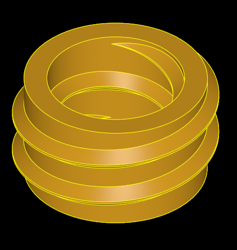

* [Hexagonal modular drawers](examples/hexagonal_drawers/assembly.py) - Inspired by [this on Prusa Printers](https://www.prusaprinters.org/prints/54113-hexagonal-organizer-system), these drawers are 3D printed (without needing supports) and clip together.

    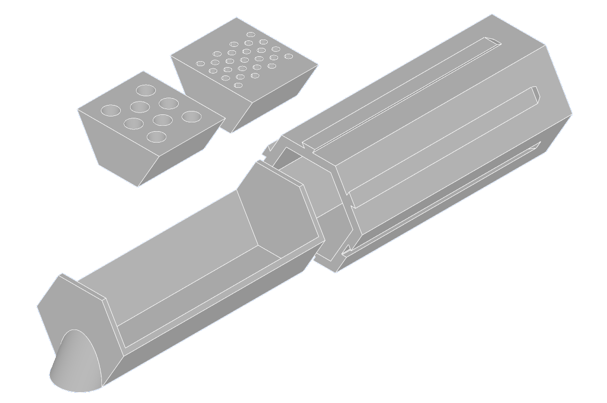
    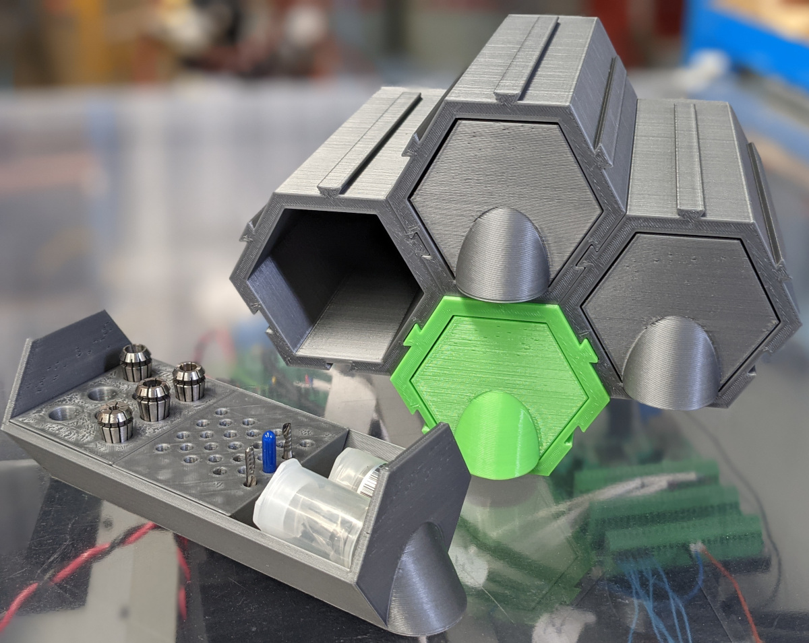
    
* [Digital sundial](https://github.com/lopezsolerluis/reloj-de-sol-digital-cadquery) - Inspired by [Mojoptix's digital sundial](https://www.thingiverse.com/thing:1068443) and derived from [my own version](https://github.com/lopezsolerluis/reloj-de-sol-digital) in OpenSCAD.

    

* [Truss Gherkin with spirals](https://github.com/moOsama76/cadquery-contrib/blob/moOsama76-patch-1/examples/truss-gherkin-building) - Inspired by [3D Beast](https://www.youtube.com/watch?v=mwJQm70NRYY)

    

* [IQON Building following a spline](https://github.com/moOsama76/cadquery-contrib/blob/moOsama76-patch-1/examples/Iqon-Building) - Inspired by [3D Beast](https://www.youtube.com/watch?v=wQvikT0DUCU)

    

* [Tiles any shape](https://github.com/moOsama76/cadquery-contrib/blob/moOsama76-patch-1/grouped-tiles) - grid of tiles constrained to any 2D shape and seperated into individual groups

    

### Tutorials

* [Ex000 Start Here.ipynb](tutorials/Ex000%20Start%20Here.ipynb) - iPython notebook that is the entry point for a set of CadQuery tutorials
* [Ex001 Simple Block.ipynb](tutorials/Ex001%20Simple%20Block.ipynb) - iPython notebook that shows how to create an extremely simple block

